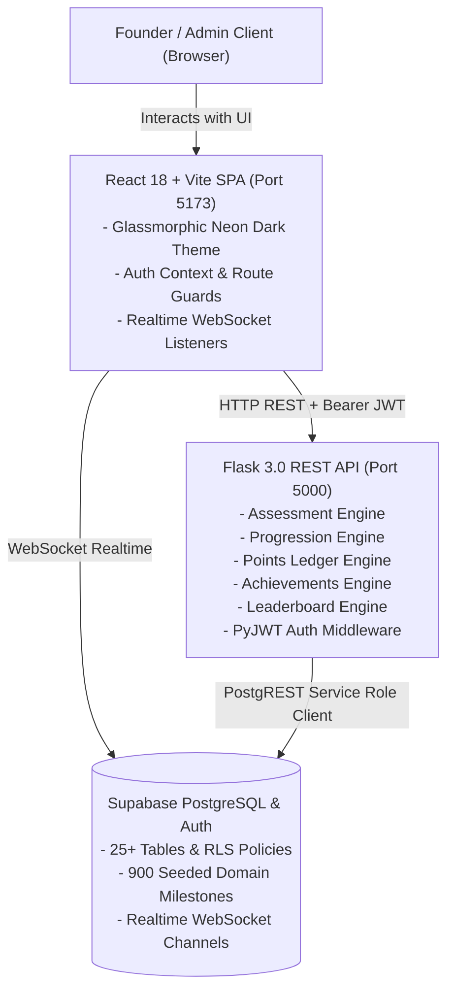
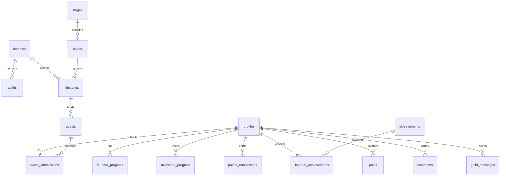

# LABX Founder Platform — Complete Master Project Documentation

---

## 1. Project Overview & Architecture

### 1.1 Mission & Purpose
**LABX** is a production-ready, database-driven **Founder Progression & Development Platform**. It provides a structured, gamified, and community-oriented roadmap for tech startup founders to progress from raw idea validation up through product launch and scaling across 12 high-growth technology domains.

### 1.2 Core Architectural Principles
- **100% Data-Driven Progression**: The database (Supabase PostgreSQL) is the single source of truth. Milestones, quests, guild assignments, and badge criteria are dynamically fetched from the database, not hardcoded on the client.
- **Server-Side Rule Engines**: Diagnostic assessment scoring, domain/stage/level mapping, quest verification, points ledger transactions, leaderboards, and sequential milestone unlocks are executed exclusively on the Flask backend.
- **Role Isolation & RBAC**: Strict separation between `founder` and `admin` roles across both backend middleware and frontend route guards.
- **Real-Time Guild Networking**: Live WebSocket-based guild chatrooms and instant in-app notification dispatch.



---

## 2. Frontend Architecture & Design System

### 2.1 Design Philosophy & Aesthetics
- **Theme**: Futuristic, sleek Dark Mode with high-contrast neon accents.
- **Surface Elevation**: Glassmorphism using semi-transparent dark layers, subtle borders, and background blur effects (`backdrop-filter: blur(12px)`).
- **Color Palette (CSS Design Tokens)**:
  - **Background Base**: `#08090d` / `#0d0f17`
  - **Surface Glass**: `rgba(255, 255, 255, 0.03)` to `rgba(255, 255, 255, 0.08)`
  - **Borders**: `rgba(255, 255, 255, 0.08)` / `rgba(255, 255, 255, 0.15)`
  - **Primary Brand / Cyan**: `#06b6d4` (`rgb(6, 182, 212)`)
  - **Purple / Indigo**: `#6366f1` / `#8b5cf6`
  - **Amber / Points / Badges**: `#f59e0b` (`rgb(245, 158, 11)`)
  - **Success / Green**: `#10b981` (`rgb(16, 185, 129)`)
  - **Danger / Red**: `#ef4444` (`rgb(239, 68, 68)`)
  - **Text Primary**: `#ffffff`
  - **Text Muted**: `#94a3b8`
  - **Text Dim**: `#64748b`

### 2.2 Typography & UI Tokens
- **Font Families**: `'Inter'`, `'Outfit'`, system sans-serif.
- **Border Radius**: Small (`6px`), Medium (`12px`), Large (`18px`), Pill (`9999px`).
- **Gradients**:
  - Brand Cyan-Indigo: `linear-gradient(135deg, #06b6d4 0%, #6366f1 100%)`
  - Golden Amber: `linear-gradient(135deg, rgba(245,158,11,0.15) 0%, rgba(99,102,241,0.1) 100%)`
  - Card Glass: `linear-gradient(180deg, rgba(255,255,255,0.04) 0%, rgba(255,255,255,0.01) 100%)`

### 2.3 Frontend Directory Structure
```
frontend/
├── public/
├── src/
│   ├── assets/
│   ├── components/
│   │   ├── common/
│   │   │   ├── Navbar.jsx          # Top persistent bar with points, notifications & profile
│   │   │   ├── Sidebar.jsx         # Responsive navigation sidebar with Leaderboard link
│   │   │   └── ProtectedRoute.jsx  # Auth & Role router guards
│   │   ├── admin/                  # Admin-specific modals & verification queues
│   │   ├── assessment/             # Diagnostic Assessment wizard & results
│   │   └── founder/                # Milestone cards, quest submission modals
│   ├── contexts/
│   │   ├── AuthContext.jsx         # Global user session & profile state
│   │   └── RealtimeContext.jsx     # Supabase Realtime channel subscriptions
│   ├── pages/
│   │   ├── LoginPage.jsx           # User sign-in with auto-confirmation handling
│   │   ├── RegisterPage.jsx        # Founder account onboarding
│   │   ├── ForgotPasswordPage.jsx  # Password recovery workflow
│   │   ├── AssessmentPage.jsx      # 7-step diagnostic evaluation wizard
│   │   ├── DashboardPage.jsx       # Founder overview, next quest CTA, milestones
│   │   ├── RoadmapPage.jsx         # Interactive roadmap tree across stages & levels
│   │   ├── LeaderboardPage.jsx     # Top 3 podium, domain & global rankings table
│   │   ├── GuildPage.jsx           # Domain-based real-time chatroom
│   │   ├── SocialPage.jsx          # Founder activity stream, posts, likes & comments
│   │   ├── AchievementsPage.jsx    # Complete badge gallery with locked/earned status
│   │   ├── ProfilePage.jsx         # Founder bio, system progression & earned badges showcase
│   │   ├── EventsPage.jsx          # Platform announcements & startup events
│   │   ├── NotificationsPage.jsx   # In-app notifications & read state manager
│   │   └── AdminDashboardPage.jsx  # Admin analytics, verification queue, quest builder
│   ├── services/
│   │   ├── api.js                  # Centralized Axios/fetch client with JWT interceptor
│   │   └── supabase.js             # Supabase JS client for WebSocket subscriptions
│   ├── App.jsx                     # Route definitions & layout wrappers
│   ├── index.css                   # Core design tokens, utility classes & animations
│   └── main.jsx                    # React entry point
```

### 2.4 Complete Pages Breakdown

| Page | Route | Access | Key Features & Layout Details |
|---|---|---|---|
| **Login** | `/login` | Public | Centered glass card with email/password authentication, auto-confirmation fallback, and seamless redirect to `/assessment` or `/dashboard`. |
| **Register** | `/register` | Public | Onboarding wizard with auto-login session generation. |
| **Forgot Password** | `/forgot-password` | Public | Clean password recovery link dispatcher. |
| **Assessment** | `/assessment` | Founder | 7-question interactive wizard evaluating tech domain, stage evidence checklist, and execution capability sliders. |
| **Dashboard** | `/dashboard` | Founder | Active milestone progress card, "Next Core Quest" CTA, LABX points counter, and guild preview tile. |
| **Roadmap** | `/roadmap` | Founder | Horizontal stage navigation tabs (`Discover`, `Validate`, `Build`, `Launch`, `Grow`), vertical level trees, expandable milestone nodes, and quest drawer. |
| **Leaderboard** | `/leaderboard` | Founder | Real-time founder rankings, Top 3 Podium (Gold 🥇, Silver 🥈, Bronze 🥉 medals), domain filter tabs, search, and sticky "Your Standing" card. |
| **Guild** | `/guild` | Founder | Assigned domain peer community, real-time message stream with Supabase Realtime, online member roster, and guild announcement board. |
| **Social Feed** | `/social` | Founder | Founder feed (following & explore), post creator with image URLs, like counters, and sliding comment drawers. |
| **Achievements** | `/achievements` | Founder | Badge gallery with live dynamic sync, unlock timestamps, and badge category filters. |
| **Profile** | `/profile` | Auth | Profile editor (bio, avatar, full name), system attributes, follower/following modals, and **Earned Badges Showcase**. |
| **Events** | `/events` | Auth | Platform event calendar, demo days, and official announcements. |
| **Notifications**| `/notifications`| Auth | Live alert stream for badge unlocks, quest approvals, and follower notifications with mark-as-read actions. |
| **Admin Portal** | `/admin` | Admin | Quest verification queue (inspect URL proofs, approve/reject with feedback), platform metrics, quest creator, and diagnostic reset tool. |

---

## 3. Backend Architecture & Service Engines

### 3.1 Flask Application Architecture
The backend is structured using Flask's application factory pattern (`create_app` in `backend/app/__init__.py`), registering 15 modular Blueprints:
- **`auth_bp`** (`/api/auth`): Authentication, token refresh, and registration.
- **`assessment_bp`** (`/api/assessment`): Diagnostic submission and scoring.
- **`roadmap_bp`** (`/api/roadmap`): Domain roadmap hierarchy with unlock states.
- **`quests_bp`** (`/api/quests`): Milestone quest lists and quest details.
- **`submissions_bp`** (`/api/submissions`): Founder deliverables submission & auto-approval.
- **`progress_bp`** (`/api/progress`): Dashboard metrics and stage progress summary.
- **`points_bp`** (`/api/points`): Points ledger transactions and balance history.
- **`leaderboard_bp`** (`/api/leaderboard`): Domain and global founder rankings.
- **`guilds_bp`** (`/api/guilds`): Guild channel details and message history.
- **`social_bp`** (`/api/social`): Social feed, posts, comments, likes, and follows.
- **`achievements_bp`** (`/api/achievements`): Badges and achievement sync.
- **`profile_bp`** (`/api/profile`): User public and private profiles.
- **`events_bp`** (`/api/events`): Announcements and events.
- **`notifications_bp`** (`/api/notifications`): Notifications management.
- **`admin_bp`** (`/api/admin`): Verification workflow and platform management.

### 3.2 Core Service Engines

#### 1. Assessment Diagnostic Engine (`assessment_engine.py`)
- **Domain Assignment (Q1)**: Maps founder to 1 of 12 industry domains.
- **Stage Evaluation (Q2 & Q3)**: Computes claimed stage vs. verified evidence checklist.
- **Level Calculation (Q4–Q7)**:
  $$\text{Score} = \frac{Q_4 + Q_5 + Q_6 + Q_7}{4}$$
  - `1.00 – 1.49` $\rightarrow$ Level 1
  - `1.50 – 2.49` $\rightarrow$ Level 2
  - `2.50 – 3.49` $\rightarrow$ Level 3
  - `3.50 – 4.49` $\rightarrow$ Level 4
  - `4.50 – 5.00` $\rightarrow$ Level 5
- **Stage Level Ceilings**:
  $$\text{Final Level} = \min(\text{Calculated Level}, \text{Stage Max})$$

#### 2. Progression Cascade Engine (`progression_engine.py`)
- **Milestone Progress**: Evaluates completed core quests against total core quests.
- **Sequential Unlock**:
  - Completing Milestone $M$ unlocks Milestone $M+1$.
  - Completing all milestones in Level $L$ unlocks Level $L+1$ and triggers `first_level` badge.
  - Completing all levels in Stage $S$ advances to Stage $S+1$ and triggers `first_stage` badge.
  - Completing the final stage triggers `roadmap_completed`.

#### 3. Points Ledger Engine (`points_engine.py`)
- **Double-Award Prevention**: Enforces a strict `UNIQUE(user_id, quest_id)` constraint on `points_transactions`.
- **Atomic Balance Updates**: Re-calculates sum of transactions and updates cached `total_points` on `profiles`.

#### 4. Achievements & Badges Engine (`achievements_engine.py`)
- Automatically evaluates and awards badges:
  - **Quests**: `first_quest` (First Quest Completed), `quests_10`, `quests_50`
  - **Progression**: `first_milestone`, `first_level`, `first_stage`, `roadmap_completed`
  - **Points**: `points_100` (100 Points), `points_500` (500 Points), `points_1000` (1000 Points)
  - **Social**: `first_post`, `first_follower`, `first_guild_message`
- **Dynamic Real-Time Sync**: Backfills and evaluates badge criteria upon visiting `/achievements` or `/profile`.

#### 5. Leaderboard Engine (`leaderboard.py`)
- Calculates rankings dynamically sorted by `total_points DESC, created_at ASC`.
- Supports filtering by domain scope (`scope=domain`), global (`scope=all`), specific domain UUID (`domain_id`), or search strings.
- Enriches every entry with current Stage/Level, tech domain, badges count, and the authenticated user's current rank standing.

---

## 4. Database Architecture & Schema Reference

The PostgreSQL database on Supabase contains 25 normalized tables:



### Table Definitions Summary
1. **`profiles`**: `id (UUID, PK)`, `email`, `full_name`, `username`, `bio`, `avatar_url`, `role ('founder'|'admin')`, `domain_id (FK)`, `guild_id (FK)`, `total_points`, `assessment_completed`, `created_at`.
2. **`domains`**: `id (UUID, PK)`, `name`, `icon`, `is_active`. (12 tech domains).
3. **`stages`**: `id (UUID, PK)`, `name ('Discover'|'Validate'|'Build'|'Launch'|'Grow')`, `stage_order`, `description`.
4. **`levels`**: `id (UUID, PK)`, `stage_id (FK)`, `level_number (1..5)`, `name`, `level_order`. (25 levels total).
5. **`milestones`**: `id (UUID, PK)`, `domain_id (FK)`, `level_id (FK)`, `name`, `description`, `milestone_order (1..3)`. (900 seeded milestones).
6. **`quests`**: `id (UUID, PK)`, `milestone_id (FK)`, `title`, `description`, `quest_type ('core'|'elective')`, `points`, `verification_required`, `deliverable_format`.
7. **`quest_submissions`**: `id (UUID, PK)`, `user_id (FK)`, `quest_id (FK)`, `submission_text`, `submission_url`, `submission_files`, `status ('submitted'|'under_review'|'approved'|'rejected')`, `admin_feedback`, `reviewed_by`.
8. **`founder_progress`**: `id (UUID, PK)`, `user_id (FK, Unique)`, `current_stage_id (FK)`, `current_level_id (FK)`, `current_milestone_id (FK)`, `roadmap_completed`.
9. **`stage_progress` / `level_progress` / `milestone_progress`**: Unlock status and completion boolean flags.
10. **`points_transactions`**: `id (UUID, PK)`, `user_id (FK)`, `quest_id (FK)`, `points`, `reason`, `created_at` (Enforces unique award per quest).
11. **`achievements` & `founder_achievements`**: Badges catalog and earned timestamp records.
12. **`posts`, `post_likes`, `comments`, `follows`**: Social networking stream and follower relations.
13. **`guilds` & `guild_messages`**: Domain-level community channels and chat logs.
14. **`notifications`**: User in-app notifications queue.

---

## 5. Complete REST API Specification

### Authentication & Profiles
- `POST /api/auth/register` — Register a new founder account.
- `POST /api/auth/login` — Sign in and receive JWT token + profile details.
- `GET /api/auth/me` — Verify token and get current user state.
- `POST /api/auth/forgot-password` — Send password reset link.
- `GET /api/profile` — Get full authenticated user profile with progress and badges.
- `PUT /api/profile` — Update user's full name, bio, and avatar.
- `GET /api/profile/<user_id>` — Get public profile of another founder.

### Assessment & Progression
- `GET /api/assessment/status` — Returns whether assessment has been completed.
- `POST /api/assessment/submit` — Submits 7 diagnostic answers and initializes roadmap state.
- `GET /api/progress` — Dashboard summary: current milestone, level, stage, points, guild.
- `GET /api/roadmap` — Full roadmap hierarchy for user's domain with lock status.

### Quests & Submissions
- `GET /api/quests/milestone/<milestone_id>` — Lists quests for a milestone.
- `GET /api/quests/<quest_id>` — Quest details and previous submissions.
- `POST /api/submissions/quest/<quest_id>` — Submit quest deliverable.
- `GET /api/submissions` — List past submissions for current founder.

### Achievements, Points, Leaderboard & Social
- `GET /api/achievements` — Get all badges with user's earned status (auto-synced).
- `GET /api/leaderboard` — Get ranked founders by LABX Points with domain/global filters and user standing.
- `GET /api/points` — Get points balance and transaction history.
- `GET /api/guilds/me` — Get domain guild info and members.
- `GET /api/guilds/messages` — Get recent guild chat messages.
- `POST /api/guilds/messages` — Post message to guild.
- `GET /api/social/feed` — Get posts feed from followed founders.
- `GET /api/social/explore` — Explore public posts across the platform.
- `POST /api/social/posts` — Create a new social post.
- `POST /api/social/posts/<id>/like` — Like or unlike a post.
- `GET /api/social/posts/<id>/comments` — Get post comments.
- `POST /api/social/posts/<id>/comments` — Add comment to post.
- `POST /api/social/follow/<user_id>` — Follow a founder.
- `DELETE /api/social/follow/<user_id>` — Unfollow a founder.
- `GET /api/notifications` — Get user notifications.
- `PUT /api/notifications/<id>/read` — Mark notification as read.
- `GET /api/events` — Get platform announcements and events.

### Admin Operations
- `GET /api/admin/analytics` — Platform metrics (total founders, domains distribution, submissions).
- `GET /api/admin/verification` — Get pending quest submissions queue.
- `POST /api/admin/verification/<id>/review` — Approve or reject a quest submission.
- `GET /api/admin/quests` — List all platform quests.
- `POST /api/admin/quests` — Create a new custom quest.
- `PUT /api/admin/quests/<id>` — Edit existing quest.
- `DELETE /api/admin/quests/<id>` — Archive/delete quest.
- `GET /api/admin/founders` — List and search all registered founders.
- `POST /api/admin/founders/<id>/reset-assessment` — Reset founder diagnostic to retake.

---

## 6. Installation, Execution & Verification

### 6.1 Prerequisites
- **Node.js**: v18.0.0 or later
- **Python**: v3.10, v3.11, or v3.12
- **Supabase Account**: With PostgreSQL project created

### 6.2 Environment Setup
1. **Backend Environment (`backend/.env`)**:
   ```env
   SUPABASE_URL=https://your-project.supabase.co
   SUPABASE_KEY=your-anon-public-key
   SUPABASE_SERVICE_ROLE_KEY=your-service-role-secret-key
   SECRET_KEY=your-jwt-secret-key
   PORT=5000
   FLASK_ENV=development
   ```

2. **Frontend Environment (`frontend/.env`)**:
   ```env
   VITE_SUPABASE_URL=https://your-project.supabase.co
   VITE_SUPABASE_ANON_KEY=your-anon-public-key
   VITE_API_URL=http://localhost:5000/api
   ```

### 6.3 Database Migrations
Run SQL scripts in `supabase/` in sequential order:
- `001_profiles.sql` through `020_seed_sample_quests.sql`
- Or execute `supabase/all_migrations.sql` in the Supabase SQL Editor.

### 6.4 Starting Local Development Servers
- **Backend**:
  ```powershell
  cd backend
  ..\.venv\Scripts\python.exe run.py
  ```
  *Server runs at `http://localhost:5000` (Health check: `http://localhost:5000/api/health`)*

- **Frontend**:
  ```powershell
  cd frontend
  npm run dev
  ```
  *Frontend runs at `http://localhost:5173`*

### 6.5 Running Tests & Build
- **Backend Tests**:
  ```powershell
  cd backend
  ..\.venv\Scripts\python.exe -m pytest
  ```
  *Result: 15/15 tests passing (100%)*

- **Frontend Production Bundle**:
  ```powershell
  cd frontend
  npm run build
  ```
  *Vite compiled cleanly in 1.51s with 0 errors.*
