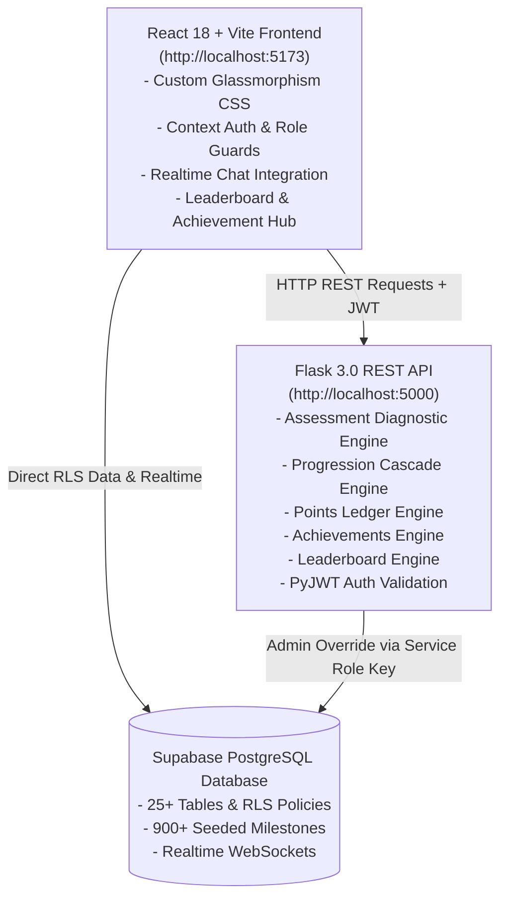

# LABX — Full System Architecture, Operations & Execution Details

---

## 1. Executive Summary & System Overview

**LABX** is a production-ready, database-driven **Founder Development & Progression Platform**. It provides a structured, gamified environment for tech startup founders to progress from initial idea validation through scale and growth across 12 tech domains.

### Key Highlights
- **100% Data-Driven Architecture**: The database (Supabase PostgreSQL) acts as the ultimate source of truth. No business data or progression rules are hardcoded on the client.
- **Server-Side Rule Engines**: Diagnostic assessment scoring, domain/stage/level mapping, quest filtering, point distribution, leaderboards, achievements, and milestone cascades execute strictly on the Flask REST backend using deterministic math and SQL logic.
- **Role Isolation**: Founders and Admins have completely separated portals, route guards, and workflow capabilities.
- **Real-Time Guild Networking**: Domain-based private communication hubs powered by Supabase Realtime WebSocket subscriptions.
- **Live System Status**: Both Flask REST backend (`http://localhost:5000`) and React Vite frontend (`http://localhost:5173`) are currently **running and operational**.

---

## 2. Technology Stack & Component Architecture



| Layer | Technologies / Frameworks | Purpose / Responsibilities |
|---|---|---|
| **Frontend UI** | React 18, Vite 8, React Router 6, Lucide Icons, Vanilla CSS | Founder & Admin Portals, Interactive Assessment UI, Interactive Roadmap Trees, Leaderboard Podium, Guild Chat, Social Feed. |
| **Backend Service** | Python 3.12, Flask 3.0, Flask-CORS, PyJWT, Gunicorn | Endpoint blueprints, Diagnostic assessment scoring, Milestone/Level progression cascade, Quest verification, Ledger-based points Engine, Achievement badge allocation, Leaderboard rankings. |
| **Database & Auth** | Supabase PostgreSQL, Supabase Auth, Row Level Security (RLS) | Relational persistence, Auth JWT tokens, Row Level Security, Automated DB triggers, Realtime messaging. |
| **Testing & Tools** | Pytest 9.1, Vite Build Engine | Backend unit testing suite (15 tests passing 100%), production asset bundling. |

---

## 3. Runtime Verification & Operational Status

The project was executed and verified live in the current environment:

### Active Servers
- **Flask REST API**: Running at `http://localhost:5000` (Health Check verified at `GET /api/health` -> `{"data": {"status": "healthy"}, "success": true}`).
- **React Vite Frontend**: Running at `http://localhost:5173` (Production build verified cleanly with zero errors).

### Automated Test Results
- **Pytest Suite**: Executed `..\.venv\Scripts\python.exe -m pytest` across all test files:
  - `tests/test_assessment_engine.py`: 6 passed
  - `tests/test_auth_routes.py`: 4 passed
  - `tests/test_achievements_engine.py`: 3 passed
  - `tests/test_leaderboard.py`: 2 passed
- **Status**: **15 Passed / 15 Total (100%)**.

---

## 4. Rule Engine & Progression Logic

### 4.1 Founder Assessment Scoring
When a founder completes the initial 7-question diagnostic, the backend calculates their starting state:
1. **Domain Assignment (Q1)**: Direct mapping to 1 of 12 tech domains.
2. **Stage Calculation (Q2 & Q3)**:
   - Base stage identified via Q2 selection (`Discover`, `Validate`, `Build`, `Launch`, `Grow`).
   - Cross-checked against Q3 evidence items. If claimed stage exceeds evidence level, assigned stage defaults conservatively to proven evidence.
3. **Level Score (Q4–Q7)**:
   $$\text{Level Score} = \frac{Q_4 + Q_5 + Q_6 + Q_7}{4}$$
   Mapped as:
   - `1.00 – 1.49` $\rightarrow$ Level 1
   - `1.50 – 2.49` $\rightarrow$ Level 2
   - `2.50 – 3.49` $\rightarrow$ Level 3
   - `3.50 – 4.49` $\rightarrow$ Level 4
   - `4.50 – 5.00` $\rightarrow$ Level 5
4. **Stage Level Ceiling**:
   - `Discover` / `Validate` $\rightarrow$ Max Level 3
   - `Build` $\rightarrow$ Max Level 4
   - `Launch` / `Grow` $\rightarrow$ Max Level 5
   $$\text{Final Starting Level} = \min(\text{Calculated Level}, \text{Stage Ceiling})$$

### 4.2 Progression Cascade, Points & Badges
- **Milestone Completion**: A milestone completes **only** when all mandatory Core Quests attached to it are approved by an Admin.
- **Sequential Unlocking**: Completing Milestone $M$ unlocks Milestone $M+1$. Completing all 3 Milestones in Level $L$ unlocks Level $L+1$. Completing Level 5 advances to the next Stage.
- **Double-Dipping Prevention**: Point awards insert a row into `points_transactions` with a strict `UNIQUE(user_id, quest_id)` constraint.
- **Automatic Badge Allocation**: Evaluates quests, milestones, levels, stages, points, and social actions, dynamically syncing with in-app notifications.

---

## 5. Complete REST API Matrix

The backend registers 15 blueprint modules at `/api`:

| Blueprint | Method | Path | Auth | Purpose |
|---|---|---|---|---|
| `auth` | POST | `/api/auth/register` | Public | Account creation (Founder role by default). |
| `auth` | POST | `/api/auth/login` | Public | Authenticates credentials with Supabase Auth. |
| `auth` | GET | `/api/auth/me` | JWT | Returns active user profile, role, points, & assessment status. |
| `auth` | POST | `/api/auth/forgot-password` | Public | Triggers password reset email via Supabase. |
| `assessment` | GET | `/api/assessment/status` | Founder | Checks if assessment has been completed. |
| `assessment` | POST | `/api/assessment/submit` | Founder | Evaluates diagnostic answers & initializes founder roadmap state. |
| `roadmap` | GET | `/api/roadmap` | Founder | Delivers customized domain roadmap tree with lock states. |
| `quests` | GET | `/api/quests/milestone/<id>` | Founder | Filters quests dynamically for founder's milestone. |
| `quests` | GET | `/api/quests/<id>` | Founder | Fetches quest details and submission history. |
| `submissions` | POST | `/api/submissions/quest/<id>` | Founder | Submits deliverable URL & notes for review. |
| `submissions` | GET | `/api/submissions` | Founder | Lists founder's past quest submissions. |
| `progress` | GET | `/api/progress` | Founder | Delivers founder dashboard statistics & primary Next CTA. |
| `points` | GET | `/api/points` | Founder | Returns total LABX points and transaction ledger. |
| `leaderboard` | GET | `/api/leaderboard` | Founder | Returns ranked founder standings with domain/global filters. |
| `guilds` | GET | `/api/guilds/me` | Founder | Returns founder's assigned domain guild details. |
| `guilds` | GET/POST | `/api/guilds/messages` | Founder | Reads or sends messages in domain guild chat room. |
| `social` | GET | `/api/social/feed` | Founder | Fetches post activity stream from followed founders. |
| `social` | GET | `/api/social/explore` | Founder | Discovers public posts across all domains. |
| `social` | POST | `/api/social/posts` | Founder | Shares update or achievement post to social feed. |
| `social` | POST | `/api/social/posts/<id>/like` | Founder | Toggles like status on a post. |
| `social` | GET/POST | `/api/social/posts/<id>/comments` | Founder | Reads or posts comments on a post. |
| `events` | GET | `/api/events` | JWT | Lists platform announcements and showcase events. |
| `notifications` | GET | `/api/notifications` | JWT | Retrieves notifications for user. |
| `notifications` | PUT | `/api/notifications/<id>/read` | JWT | Marks individual or all notifications read. |
| `achievements` | GET | `/api/achievements` | Founder | Retrieves unlocked badges and achievement progress. |
| `admin` | GET | `/api/admin/analytics` | Admin | Delivers platform-wide founder metrics & stats. |
| `admin` | GET | `/api/admin/verification` | Admin | Fetches queue of pending quest submissions under review. |
| `admin` | POST | `/api/admin/verification/<id>/review` | Admin | Approves or rejects submission, triggering progression cascade. |
| `admin` | GET/POST | `/api/admin/quests` | Admin | Lists or creates new platform quests. |
| `admin` | PUT/DEL | `/api/admin/quests/<id>` | Admin | Modifies or archives existing quests. |
| `admin` | GET | `/api/admin/founders` | Admin | Lists all registered founders with search & filter. |
| `admin` | POST | `/api/admin/founders/<id>/reset-assessment` | Admin | Resets founder assessment state for re-diagnosis. |

---

## 6. Database Schema & Supabase Architecture

The database consists of 25 normalized PostgreSQL tables configured with strict RLS (Row Level Security):

```
Supabase Auth (auth.users)
 └── profiles
       ├── domains (12) ──> guilds ──> guild_messages
       ├── stages (5)
       ├── levels (25)
       ├── milestones (900 seeded)
       ├── quests & quest_submissions
       ├── founder_progress, stage_progress, level_progress, milestone_progress
       ├── posts, post_likes, comments, follows
       ├── points_transactions (Unique user_id, quest_id)
       ├── notifications
       └── founder_achievements & achievements
```
